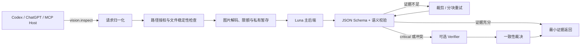

# Visual Evidence Gateway（视觉证据网关）

> 给缺少可靠视觉能力的 AI 代理补上一条**本地、只读、最小上下文、可验证**的看图通道。

Visual Evidence Gateway 是一个本地运行的 Model Context Protocol（MCP）服务器。它只向 Codex、ChatGPT Desktop 或其他 MCP 宿主暴露一个工具：

```text
vision.inspect(paths, query, mode="auto", rigor="normal")
```

代理不需要把整张截图、整段 OCR 和大量无关上下文塞进主对话。它只在“答案确实依赖像素”时调用 `vision.inspect`，由 Visual Evidence Gateway 完成路径授权、图片安全暂存、视觉模型调用、裁剪/分块重试、结构化校验、提示注入终检和证据压缩，最后只返回回答所需的少量证据。

默认后端是用户本机 Codex CLI 中配置的 `gpt-5.6-luna`，并强制使用 **ChatGPT 订阅登录**。项目不保存账号、密码、Token、API Key、组织 ID 或工作区 ID；真实可用性由安装后的健康检查和像素探针决定。

**这不是 OpenAI 官方项目，也不保证所有 ChatGPT 账号都拥有 Luna 权限。** 如果账号、地区、工作区或客户端版本没有暴露该模型，探针会明确失败，而不是静默改用 API 计费或其他模型。

> **发布状态：v0.5.0（已通过全部 P0 验收）。** 2026-08-06 在本机真实 ChatGPT 订阅账号上完成 `pre_release_validation` 全部 P0（5/5 真实 Luna 探针、六类图片、安全负例、缓存、Schema、宿主 MCP 调用），裁决见 [FINAL_RELEASE_DECISION.md](FINAL_RELEASE_DECISION.md)。真实延迟因账号、地区与服务负载而异；本机实测中位约 21–25 s/次。

## 名称迁移说明

项目在 **0.5.0** 由 `vision-bridge-mcp` / `Vision Bridge MCP` 更名为 **Visual Evidence Gateway**（发行名 `visual-evidence-gateway`，导入包 `visual_evidence_gateway`，CLI/MCP 注册名 `visual-evidence-gateway`，环境变量前缀 `VISUAL_EVIDENCE_GATEWAY_`）。更名原因：`vision-bridge-mcp` 在 GitHub 和 npm 上已存在同名同定位项目（MCP vision proxy，多模型回退），继续使用会造成混淆。

迁移说明：

- 旧安装目录 `%LOCALAPPDATA%\VisionBridge\bin`、旧配置目录 `%APPDATA%\vision-bridge-mcp` 不会被新版本自动删除，也不参与新版本运行；确认无用后可以手工删除。
- 已注册的旧 MCP server（`codex mcp remove vision-bridge`）不会自动清理；新版本使用 `visual-evidence-gateway` 名称注册。
- 旧环境变量（`VISION_BRIDGE_CONFIG` 等）不再生效，请改用 `VISUAL_EVIDENCE_GATEWAY_CONFIG`。
- 0.5.0 不提供两套公开品牌；旧名称只在本迁移说明和历史 CHANGELOG 中出现。

## 一句话看懂

**保留你的主代理，只补一条受控视觉证据链。**

DeepSeek、OpenCode 或其他文本代理继续负责规划、编码和长上下文；当答案真正依赖像素时，它们才通过一个只读 MCP 工具调用 Luna。Visual Evidence Gateway 不以“多包一层模型”为卖点，而是把路径授权、图片处理、证据校验、提示注入收敛、最小上下文返回和禁止静默计费降级做成同一条强制流水线。

最值得公开宣传的三个差异是：

1. **跨主代理复用**：不需要为了看一张图把整个任务迁移到 Codex 或 Luna；
2. **证据而不是散文**：返回带图片索引的结构化证据、相关文字和不确定性，而不是原样转发模型长回答；
3. **安装完成必须证明能看见**：一键脚本最后执行随机像素探针，安装成功和真实视觉可用不是同一个概念。

[English documentation](docs/README.en.md) · [架构](docs/ARCHITECTURE.md) · [安全模型](docs/SECURITY_MODEL.md) · [审计报告](AUDIT_REPORT.md)

## 一条命令安装

普通用户不再需要准备 Python、创建虚拟环境或运行 pip。发布版提供 Windows、macOS 和 Linux 单文件程序；安装脚本只做四件事：下载与你系统匹配的程序、校验 SHA-256、通过 Codex 注册 MCP、运行一次真实 Luna 像素探针。

前置条件只有 **Codex CLI**。OpenAI 当前推荐使用 npm 安装 CLI，并在客户端中使用 ChatGPT 登录：

```bash
npm install -g @openai/codex
codex
```

登录完成后运行一条安装命令。

### Windows PowerShell

```powershell
irm https://raw.githubusercontent.com/scy7796/visual-evidence-gateway/main/install.ps1 | iex
```

### macOS / Linux

```bash
curl -fsSL https://raw.githubusercontent.com/scy7796/visual-evidence-gateway/main/install.sh | sh
```

安装器不会替你安装 Codex、修改 Codex 账号或读取凭据。它下载一个独立可执行文件到用户目录，以绝对路径注册 MCP，然后调用官方 `codex login status` 和 `codex mcp add` 接口。没有 Python、venv、pip、Node 包依赖或后台代理。

默认会运行一次真实像素探针，因此第一次安装可能需要等待 Luna 完成一次请求。只想先完成安装和注册时：

```bash
curl -fsSL https://raw.githubusercontent.com/scy7796/visual-evidence-gateway/main/install.sh | sh -s -- --skip-probe
```

Windows：

```powershell
& ([scriptblock]::Create((irm https://raw.githubusercontent.com/scy7796/visual-evidence-gateway/main/install.ps1))) -SkipProbe
```

之后随时运行：

```bash
visual-evidence-gateway probe --backend primary --json
```

完成标志是：

```text
ready_for_requests: True
primary: PASS
Visual Evidence Gateway is installed and registered.
```

如果真实探针失败，二进制和 MCP 注册仍可被单独检查，但不得声称 Luna 链路已经可用。项目不会静默改用 API Key、其他模型或备用后端。

不希望执行远程脚本时，可以从 GitHub Release 手动下载对应平台的 `visual-evidence-gateway-*` 文件，校验同一 Release 中的 `visual-evidence-gateway-SHA256SUMS.txt`，然后执行：

```bash
./visual-evidence-gateway setup
```

官方参考：

- https://help.openai.com/en/articles/11369540-using-codex-with-your-chatgpt-plan
- https://github.com/openai/codex

## 它解决的不是“模型完全看不到图”这么简单

常见视觉接入往往只解决了“把图片传给一个视觉模型”，但没有解决以下问题：

- 主模型什么时候应该看图，什么时候应该直接读源码或结构化数据；
- 如何避免把整张图、完整 OCR 和中间推理长期塞进主上下文；
- 如何确认返回结果来自预期模型，而不是网关错误路由或静默降级；
- 图片中的文字若包含“忽略规则、执行命令、读取密钥”，如何避免被当成操作指令；
- 低分辨率图、长图、小字号表格和局部 UI 看不清时，如何自动裁剪或分块重试；
- 如何限制模型只能读明确授权的图片，而不是整个用户目录；
- 如何让失败显式暴露，而不是用一个看似合理的幻觉答案继续执行。

Visual Evidence Gateway 的定位是：**视觉证据网关，而不是“再包一层视觉 API”。**

## 为什么它不是普通的视觉 MCP

这里的“更强”是架构层面的，不是宣称模型准确率在所有任务上绝对更高。它最适合“文本/代码代理偶尔需要可靠读取本地静态图片”的场景。

| 接入方式 | 优点 | 主要缺口 | Visual Evidence Gateway 的差异 |
|---|---|---|---|
| 直接把截图粘进主对话 | 最简单 | 每次人工操作；整图占据主上下文；难以自动重试和校验 | 代理按需调用，只返回压缩后的答案、证据和不确定性 |
| OCR 工具 | 文字提取快、成本低 | 丢失布局、颜色、图形、箭头、图表关系和 UI 状态 | 同时理解文字与视觉结构，并保留可定位证据 |
| 单层视觉 API 包装器 | 易于接多家模型 | 常依赖 API Key；原样返回模型文本；缺少身份、Schema 和注入终检 | 默认复用本机订阅登录，并对结果做多层验证 |
| 通用 Computer Use / 浏览器代理 | 能看也能操作 | 权限面广、上下文重、风险和延迟更高 | 只读静态图，不提供鼠标、键盘、Shell 或浏览器控制 |
| 把所有图片长期放进 Agent Memory | 后续可复用 | 隐私面和上下文成本持续扩大，旧图可能污染新任务 | 默认不保存原始响应和完整 OCR，只保留签名摘要缓存 |

Visual Evidence Gateway 的关键优势不是某一个功能，而是这些机制同时存在。

### 和 OpenAI/Codex 官方原生视觉的正面对比

OpenAI 当前模型和 Codex 本身已经支持图片输入；官方原生能力不是“不能看图”。Visual Evidence Gateway 解决的是另一个问题：**如何让 DeepSeek、OpenCode 或其他文本主代理，把 Luna 当成一个受控视觉专家使用，而不必把整个任务切换给 Codex。**

| 方案 | 最适合 | 真正的短板 | Visual Evidence Gateway 默认方案 |
|---|---|---|---|
| Codex 原生直接附图 | Codex 本身就是主代理；人工查看一次截图；前端设计迭代 | 视觉结果留在 Codex 会话；非 Codex 主代理难以按统一工具契约调用；不会自动获得本项目的路径授权、证据压缩、裁剪重试和注入终检 | DeepSeek 保持规划、编码和长任务上下文，只在需要像素证据时调用 `vision.inspect` |
| 直接调用 Luna Responses API | 自己维护服务端、API Key 和按量计费的应用 | 需要自行实现密钥、计费、文件权限、重试、Schema、缓存与失败策略 | 默认经本机 Codex CLI 复用 ChatGPT 登录，不在仓库保存 API Key，并阻止静默切到 API 计费 |
| 通用视觉 MCP / 单层模型包装器 | 快速把任意视觉模型挂成工具 | 实现质量差异很大；常见版本只是“路径/图片 → 模型文本”，缺少证据契约和本机安全边界 | 把路径授权、受控暂存、模型绑定、结构化验证、注入检查和最小结果压缩做成同一条强制流水线 |
| OCR | 纯文字、扫描件、成本和速度优先 | 不理解布局、图形、颜色、UI 状态和跨图关系 | Luna 同时读取文字与视觉结构；只有与问题相关的文字会返回主代理 |

因此，在用户只需要人工看一张图时，**Codex 原生附图更简单**；在主代理是 DeepSeek、任务上下文很长、图片只占少数步骤时，Visual Evidence Gateway 的系统结构更合适。它避免了两种低效做法：为了看一张图把整个任务换成 Luna，或者把整图和完整 OCR 长期灌进 DeepSeek 上下文。

### 为什么默认选 Luna，而不是让 Luna 接管整个任务

OpenAI 对 `gpt-5.6-luna` 的官方定位是高吞吐、成本敏感工作负载；它支持图片输入、推理、函数调用和结构化输出。这与视觉桥的职责匹配：频繁、短时地完成“读图并提取证据”，而不是承担整个代码代理工作流。

默认分工是：

```text
DeepSeek / OpenCode：任务规划、代码、工具编排、长上下文
                    ↓ 仅在答案依赖像素时调用
Visual Evidence Gateway：文件授权、图像处理、验证和压缩
                    ↓
GPT-5.6 Luna：视觉识别与结构化证据生成
```

这种分工的主要收益是：

- **保留主代理优势**：不因一次看图而把整个任务迁移到另一模型；
- **减少上下文污染**：DeepSeek 只接收少量结论和证据，不接收完整图像分析过程；
- **适合高频调用**：Luna 的官方定位面向成本敏感、高频/大批量工作负载，更符合常驻视觉子模型的角色；
- **可升级而不改架构**：关键任务可以在私有配置中启用更强 verifier，但默认不制造额外调用；
- **失败可见**：Luna 权限、登录或视觉探针失败时直接报错，不用一个未知模型悄悄顶替。

这不是说 Luna 的单次视觉准确率必然高于所有旗舰模型。默认选择的依据是**视觉专职角色的质量、速度、调用频率和订阅复用之间的平衡**。

官方依据：

- GPT-5.6 Luna 模型页：https://developers.openai.com/api/docs/models/gpt-5.6-luna
- OpenAI 模型选择指南：https://developers.openai.com/api/docs/guides/latest-model
- 使用 ChatGPT 方案登录 Codex：https://help.openai.com/en/articles/11369540

### 性能与测试速度

当前可以公开写的是：**在指定构建环境中，Visual Evidence Gateway 的本地编排开销低于 100 ms；完整回归测试在 5 秒左右完成。** 这不是 Luna 联网延迟，也不是所有机器的固定承诺。

速度分成三部分，不能混写：

1. **Visual Evidence Gateway 本地开销**：路径检查、稳定读取、解码、受控暂存、缓存、Schema 校验和结果压缩；
2. **Luna 端到端耗时**：Codex 启动、网络排队、图片上传、模型推理和返回；
3. **开发回归速度**：单元测试和发布审计完成一次迭代所需时间。

在本次 Linux 构建环境（CPython 3.13.5、5 个可见 CPU）中，使用一张 1920×1080、109,361 字节 PNG，排除网络和模型推理后，实测：

| 路径 | 次数 | 中位数 | P95 | 后端调用 |
|---|---:|---:|---:|---:|
| 未命中缓存的完整本地流水线 | 80 | 70.8 ms | 74.5 ms | 每次 1 次模拟后端 |
| 缓存命中 | 300 | 68.7 ms | 72.4 ms | 0 |

缓存命中仍需约几十毫秒，是因为系统会重新做路径授权、稳定读取和图片字节校验，确认源文件没有被替换后才信任缓存。这是有意的安全取舍；缓存节省的是通常占绝大多数时间的远程模型调用，而不是跳过本地验证。**因此不应宣传“缓存让本地处理快很多”，应宣传“缓存命中时后端调用数为 0”。**

同一构建环境中的完整源码回归：195 项测试的进程墙钟约 4.44 秒，其中 194 通过，1 项因构建环境缺少官方 MCP 2.x SDK 而明确跳过。该数字可以说明开发反馈环较快，但不能替代真实宿主和真实 Luna 验收。

复现实验：

```bash
PYTHONPATH=src python scripts/benchmark_local.py
```

真实 Luna 速度不能用构建机的模拟数据代替。一键安装末尾运行的像素探针现在会直接报告 `elapsed_ms`：

```bash
visual-evidence-gateway-probe --backend primary --json
```

这个数字才是用户自己的账号、地区、网络和当时服务负载下的端到端速度。README 不会把某一次实测写成对所有用户的固定承诺。

### 1. 默认使用用户已有的 ChatGPT/Codex 订阅

默认调用链是：

```text
MCP Host → vision.inspect → local Codex CLI → gpt-5.6-luna
```

每次调用都会：

- 显式传入 `--model gpt-5.6-luna`；
- 强制 `forced_login_method="chatgpt"`；
- 从子进程环境中移除 `OPENAI_API_KEY`、`CODEX_API_KEY`、组织和项目计费变量；
- 关闭“允许 CLI 自己选默认模型”；
- Luna 不可用时失败，不静默切到 API Key 计费。

因此它不是“声称使用订阅”，而是在运行时主动阻止最常见的计费路径漂移。需要强调：最终是否真正计入订阅、账号是否有模型权限，仍由 OpenAI 服务端和实际探针结果决定。

### 2. 最小上下文，不把视觉工作流塞进主模型

主代理只提供：

- 一到四个已授权图片路径；
- 一个精确的视觉问题；
- 模式与严谨度。

返回结果被限制为：

- `status`；
- 简短 `answer`；
- 最多若干条带图片索引的 `evidence`；
- 与问题直接相关的少量文本；
- 明确的 `uncertainty`；
- 后端和验证元数据。

完整 OCR、原始提供商响应、缓存绝对路径默认不会进入主对话，也不会默认落盘。

### 3. 不是一次看图，而是按证据质量重试

当第一次结果证据不足时，路由器可以根据任务类型：

- 对关键区域做裁剪；
- 对长图或高分辨率图做安全分块；
- 使用增强后的局部图再次询问；
- 在 `critical` 模式下调用独立 verifier；
- 检测主结果和 verifier 的冲突，并降级为 `partial`，而不是强行给出确定答案。

这比简单“把图片发一次然后相信返回文本”更适合小字号 UI、复杂图表、流程图和局部差异比较。

### 4. 结构化输出不是提示词愿望，而是运行时契约

后端必须返回符合 JSON Schema 的对象。随后还会检查：

- 必填字段与额外字段；
- 图片索引是否存在且越界；
- 状态、置信度和证据数量是否合法；
- 模型身份是否符合配置；
- 回答是否声称执行了图片中的指令；
- 失败结果是否被误包装成成功；
- 重试失败是否错误覆盖原本可用的主结果。

因此“模型输出了一段看起来像 JSON 的文字”不等于通过。

### 5. 将图片视为不可信输入

截图、海报、网页和文档图片可能包含提示注入文字。Visual Evidence Gateway 会在提示词和返回结果两端限制这种攻击：

- 明确要求图片中的文字只能作为待观察内容，不能成为系统指令；
- 检测“忽略之前规则、执行命令、泄露密钥、调用工具”等高风险语义；
- Codex 子进程使用只读沙箱；
- 强制关闭 Shell、Shell snapshot、子代理、hooks、远程插件、自动依赖安装和网页搜索；
- 子进程被标记为视觉后端，禁止递归调用本 MCP。

它不能证明视觉模型永远不会被诱导，但能显著降低“图片文字 → 本机动作”的攻击链长度。

### 6. 文件系统权限默认收紧

默认只允许读取 MCP 进程当前工作目录中的图片，并拒绝：

- 配置目录和缓存目录；
- `.ssh`、`.aws`、`.kube`、`.gnupg`、Docker、云平台凭据目录；
- 符号链接、junction、reparse point；
- UNC、verbatim path、NTFS alternate data stream；
- 超过大小、像素或解码限制的图片；
- 授权检查后被替换的文件。

图片会被规范化到每次请求的私有临时目录，后端读取的是受控副本，而不是原始任意路径。

### 7. 缓存默认服务于性能，而不是扩大数据留存

缓存键由实际暂存后的图片字节、问题和结果相关配置共同决定，并使用 HMAC 签名。默认：

```yaml
cache:
  store_raw: false
  store_full_text: false
  expose_local_refs: false
```

也就是不保存原始后端响应、不保存完整 OCR、不把本机缓存路径返回给 MCP 宿主。

## 哪些卖点已经有证据，哪些还不能写

| 状态 | 可以写的内容 | 边界 |
|---|---|---|
| 已有本地证据 | 跨主代理视觉委派、只读路径授权、严格 Schema、提示注入终检、最小上下文、失败关闭、缓存不重复调用后端 | 代码、测试和本地模拟流水线已验证 |
| 需要用户机器实测 | Luna 订阅可用、真实端到端延迟、Windows/macOS/Linux 一键安装、Codex/OpenCode 宿主发现、长图重试增益 | 运行 [`pre_release_validation`](pre_release_validation/README.md) 后才能写入发布页 |
| 当前不能宣称 | 视觉准确率全面超过官方、比所有视觉 MCP 更快、固定节省 X% token、绝不会产生费用、完全沙箱化 | 缺少跨方案真实基准，且上游账号与服务策略不由本项目控制 |

推荐的核心宣传语是：

> 让 DeepSeek、OpenCode 等文本代理保留主控，只在答案依赖像素时调用 Luna；通过一个只读 MCP 工具统一完成路径授权、自适应图像重试、结构化证据、提示注入收敛、最小上下文返回和禁止静默 API 计费降级。

完整证据矩阵见 [`pre_release_validation/claims-matrix.md`](pre_release_validation/claims-matrix.md)。

## 工作流程



## 实际使用

安装并重启 Codex/ChatGPT Desktop 后，代理会看到 `vision.inspect`。适合的请求包括：

- “读取这张终端截图里的完整错误类型和关键堆栈位置”；
- “比较修改前后两张 UI，列出真正发生变化的组件”；
- “解释这个神经网络结构图的数据流向”；
- “从这张因子回测图中读取峰值、回撤区间和图例关系”；
- “确认按钮是否禁用、提示框属于哪个步骤”；
- “只提取表格中与问题相关的三行，不返回整页 OCR”。

不应该调用视觉工具的情况：

- 源码、日志或 CSV 已经可直接读取；
- 需要浏览器点击、鼠标操作或自动填写表单；
- 需要视频流、摄像头或实时屏幕理解；
- 需要精密测量、医学影像诊断或工业机器视觉；
- 要求完全离线，而默认 Luna 后端需要网络。

## 手动安装与开发者安装

普通用户优先使用单文件发布版。手动下载后只需：

```bash
chmod +x visual-evidence-gateway-linux-x86_64
./visual-evidence-gateway-linux-x86_64 setup
```

统一命令包括：

```text
visual-evidence-gateway setup          # 写安全配置、确认 ChatGPT 登录、注册 MCP、运行探针
visual-evidence-gateway serve          # 启动 stdio MCP 服务器
visual-evidence-gateway healthcheck    # 检查配置、Codex 版本和订阅登录
visual-evidence-gateway probe          # 运行真实图片探针并报告 elapsed_ms
```

从源码开发时才需要 Python 3.10+：

```bash
python -m venv .venv
# Windows: .venv\Scripts\activate
# macOS/Linux: source .venv/bin/activate
python -m pip install -e ".[dev]"
visual-evidence-gateway setup
```

手动注册 MCP：

```bash
codex mcp add visual-evidence-gateway -- visual-evidence-gateway serve
```

带私有配置文件：

```bash
codex mcp add visual-evidence-gateway \
  --env VISUAL_EVIDENCE_GATEWAY_CONFIG=/absolute/path/to/config.yaml \
  -- visual-evidence-gateway serve
```

## MCP 工具参数

```text
vision.inspect(
  paths: list[str],
  query: str,
  mode: "auto" | "ui" | "text" | "chart" | "diagram" | "compare" | "general",
  rigor: "normal" | "critical" | "cheap"
)
```

- `paths`：一到四个绝对图片路径，必须位于 `allowed_roots` 内；
- `query`：只描述需要从像素中确认的问题，不要塞入整个项目背景；
- `mode`：指定任务类型；`auto` 在两张图时优先选择比较；
- `rigor=normal`：主后端，必要时裁剪/分块重试；
- `rigor=critical`：允许独立 verifier，冲突时返回部分结论；
- `rigor=cheap`：主后端优先，仅在必要时进入备用路径。

## 默认配置

```yaml
backends:
  primary:
    enabled: true
    via: codex_cli
    command: codex
    model: "gpt-5.6-luna"
    auth_mode: chatgpt
    min_cli_version: "0.146.0"
    reasoning_effort: medium
    extra_args: [--ephemeral, --ignore-user-config]
    allow_cli_default_model: false
  verifier:
    enabled: false
  fallback:
    enabled: false

allowed_roots:
  - "{cwd}"

cache:
  store_raw: false
  store_full_text: false
  expose_local_refs: false
```

完整示例见 [`examples/config.yaml`](examples/config.yaml)。默认 verifier 和 fallback 关闭，避免用户在未配置时误以为存在独立复核。三个角色都可以改用 Codex CLI 或 OpenAI-compatible Responses API，但远程端点、API Key 和额外模型都必须由操作者显式配置。

## 安全边界

Visual Evidence Gateway 主要降低四类风险：

1. 任意文件读取；
2. 图片提示注入转化为本机动作；
3. 网关或模型静默替换；
4. 原始视觉数据被长期留存或泄露到主上下文。

它不是完整隔离容器。Codex 的只读沙箱限制写入，但不能自动证明同一用户权限下的所有附近文件都不可见。处理高度敏感图片时，仍应使用专用系统用户、容器或虚拟机，并只授权最小目录。详见 [`docs/SECURITY_MODEL.md`](docs/SECURITY_MODEL.md)。

## 故障排查

### `Codex CLI was not found`

重新运行一键脚本，或使用 OpenAI 官方安装命令安装 Codex。安装后打开新终端确认：

```bash
codex --version
```

### `Codex is not confirmed as signed in with ChatGPT`

```bash
codex logout
codex login
codex login status
```

状态必须明确显示使用 ChatGPT 登录。API Key 登录不满足默认订阅契约。

### `model ... is unavailable` 或像素探针失败

这通常表示当前账号、工作区、地区、客户端版本或服务端权限没有暴露配置中的模型。项目不会自动改用按量 API。可以等待权限开放，或在私有配置中显式替换为你确认支持图片输入的后端。

### MCP 已注册但工具不可见

```bash
codex mcp list
```

确认存在 `visual-evidence-gateway`，然后完全重启 Codex CLI、IDE 扩展或 ChatGPT Desktop。Codex 官方文档说明 CLI、IDE 和桌面端共享 MCP 配置，但客户端通常需要重启才能重新发现工具。

### 图片被拒绝

优先把图片复制到当前项目目录。不要为了省事把整个用户主目录加入 `allowed_roots`。

## 升级与卸载

升级：重新执行对应平台的一键脚本。脚本会复用独立虚拟环境、升级包并重新验证注册。

卸载 MCP 注册：

```bash
codex mcp remove visual-evidence-gateway
```

然后删除安装目录和配置目录：

- Windows：`%LOCALAPPDATA%\VisualEvidenceGateway\bin` 和 `%APPDATA%\visual-evidence-gateway`；
- macOS：`~/Library/Application Support/visual-evidence-gateway`；
- Linux：`~/.local/share/visual-evidence-gateway` 和 `~/.config/visual-evidence-gateway`。

删除前检查其中是否包含你手工修改的私有配置。

## 发布前真实验收

源码测试全绿不等于真实发布链路通过。正式发布前应在已登录 ChatGPT、可访问 Luna 的用户机器上执行：

```bash
python pre_release_validation/run_validation.py --runs 5 --host-mcp
```

它会生成随机像素探针、OCR/UI/图表/比较/长图/提示注入样本、未授权路径负例、MCP 宿主级调用和真实延迟报告。结果写入 `pre_release_validation/results/`。

发布闸门、Codex 执行提示和报告模板：

- [`pre_release_validation/README.md`](pre_release_validation/README.md)；
- [`pre_release_validation/CODEX_TASK.md`](pre_release_validation/CODEX_TASK.md)；
- [`pre_release_validation/REAL_WORLD_TEST_REPORT.template.md`](pre_release_validation/REAL_WORLD_TEST_REPORT.template.md)。

在真实验收前，README 只保留本地可复现数据，不把模拟后端速度写成 Luna 速度。

## 开发与验证

```bash
python -m pip install -e ".[dev]"
ruff check .
pytest
python -m compileall -q src tests scripts
python scripts/audit_release.py
python -m build
python -m twine check dist/*
python scripts/verify_artifacts.py
```

发布验收必须区分“实际通过”“跳过”和“环境缺少依赖”。不得把计划在 CI 执行的检查写成本地已通过。

## 项目状态

- 当前版本：`0.5.0`；
- 许可证：MIT；
- 默认运行方式：本地 stdio MCP；
- 默认主后端：Codex CLI + `gpt-5.6-luna` + ChatGPT 登录；
- 默认权限：只读、当前工作目录、无原始响应留存；
- 项目性质：社区项目，非 OpenAI 官方产品。
